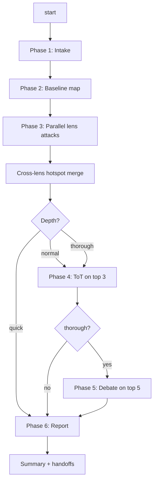

# Attack Architecture

Adversarially critique an existing codebase (or a user-defined scope) for architectural smells the next engineer will hate. This is **not** a bug hunt and **not** a pre-implementation design pass — it is a second opinion on an existing design, delivered by parallel attack agents, tree-of-thought expansion, and attacker/defender debate.

## When to use

- Hardening a module before a rewrite.
- Auditing AI-generated code for slop that ordinary review misses.
- Pre-freeze review of a subsystem.
- You have a nagging feeling the design is wrong and want a structured adversarial pass.

## When NOT to use

- Bug hunts on recent changes → use `superpowers:code-reviewer` / `feature-dev:code-reviewer`.
- Pre-implementation design → use `superpowers:brainstorming`.
- Statement-level simplification of recent diffs → use `code-simplifier` / `simplify`.
- Security review → use `/security-review`.

## Process



Every agent dispatch uses `subagent_type: Explore` — read-only (Glob/Grep/Read, no Edit). **Attackers accuse, they don't design.** Fixes are produced only in Phase 4.

## Phase 1 — Intake

Ask **one question at a time**. Multiple-choice preferred. Do not batch.

1. **Scope** — repo root / a specific directory / a named feature area (free text). Default: repo root.
2. **Lens selection** (multi-select; default = all 5 core):
   - L1 Overengineering
   - L2 Data-model / contract inelegance
   - L3 Coupling & module boundaries
   - L4 Silent failures & error handling
   - L5 Evolvability / change-cost
   - L6 Concurrency & state _(opt-in)_
   - L7 Performance hot paths _(opt-in)_
3. **Context constraints** (multi-select, optional) — frozen areas, recent incidents, small team, hot path, legacy we can't touch, AI-generated code, nothing special.
4. **Depth** — `quick` (L1+L2 only) / `normal` (all selected + ToT on top 3) / `thorough` (all selected + ToT + debate on top 5).

Store answers as in-memory working state. No design doc; this is review, not construction.

## Phase 2 — Baseline map

One read-only pass using Glob + Read. Inventory the scope: directory layout, entry points, module boundaries, headline types, dependency shape. **Budget: ≤15 file reads.** Condense to ≤60 lines. This map is passed verbatim to every Phase-3 attacker so they do not re-explore.

## Phase 3 — Parallel lens attacks

**Dispatch all selected lens agents in a single message** (multiple `Agent` tool calls in one assistant turn). Each gets a prompt from `references/lens-prompts.md` with these placeholders filled: `{SCOPE}`, `{BASELINE_MAP}`, `{CONSTRAINTS}`, `{LENS_ID}`.

**Every finding must use this schema:**

| Field          | Type                                  | Notes                                              |
| -------------- | ------------------------------------- | -------------------------------------------------- |
| `title`        | string, ≤10 words                     |                                                    |
| `lens`         | `L1`..`L7`                            | Required so cross-lens coincidence can be measured |
| `evidence`     | list of `file:line` with a real quote | No speculation-only items                          |
| `severity`     | `low` / `med` / `high`                |                                                    |
| `confidence`   | 0–100                                 |                                                    |
| `blast_radius` | `narrow` / `module` / `cross-cutting` |                                                    |

### Cross-lens hotspot merge

After agents return, rank findings by:

```
severity_weight × confidence × (1 + 0.5 × (lens_hits − 1))
```

where `severity_weight` is `1/2/3` for low/med/high, and `lens_hits` is the number of distinct lenses that flagged the same module/file. A module that shows up in multiple lenses gets a boost — that is the principal-engineer signal.

## Phase 4 — Tree-of-thought expansion _(skip if depth = quick)_

For the top 3 ranked findings, dispatch **up to 3 parallel Explore agents in one message**. Each expands one finding into:

- **Upstream cause** — what decision led here? (trace with Grep/Read).
- **Downstream risk** — what concretely breaks, rots, or slows?
- **Minimal fix** — smallest diff that removes the smell.
- **Structural fix** — what the design would look like if done from scratch.

## Phase 5 — Debate _(only if depth = thorough)_

For the top 5 ranked findings, run the 3-agent debate from `references/debate-protocol.md`:

1. **Attacker + Defender in parallel**, one message. Both see the finding + baseline map + cited code.
2. **Judge** (separate dispatch, after the pair returns). Structured verdict: `confirmed` / `exaggerated` / `dismissed`, plus `final_confidence` (0–100), `rationale` (≤100 words), `recommended_action` (≤30 words).

`dismissed` findings are pruned from the mitigation plan but their debate transcript is preserved.

## Phase 6 — Synthesis + report

Write a single report to `.docs/arch-attacks/YYYY-MM-DD-<scope-slug>.md` using `references/report-template.md`. If `.docs/` does not exist in the target repo, ask the user **once** (create `.docs/` vs. use `docs/` vs. custom path) before writing.

Report contents:

- **Front-matter** — scope, date, depth, selected lenses, intake answers (traceability).
- **Executive summary** — top 5 findings, one-line impact + recommended action.
- **Hotspots** — modules/files where 2+ lenses converged.
- **Findings by lens** — full schema per finding.
- **Debate transcripts** — Phase 5 findings only.
- **Ranked mitigation plan** — triaged by impact × effort.
- **What was NOT attacked** — explicit out-of-scope list, prevents false reassurance.

Then emit a short chat summary and offer three handoffs:

1. Brainstorm a restructure for the top finding (`superpowers:brainstorming`).
2. Plan concrete fixes (`superpowers:writing-plans`).
3. Stop.

## Quick reference — lenses

| Lens                          | Targets                                                                                                                                                                                                                    |
| ----------------------------- | -------------------------------------------------------------------------------------------------------------------------------------------------------------------------------------------------------------------------- |
| **L1 Overengineering**        | Speculative generalization; abstractions with one impl; unused flexibility; indirection that buys nothing; dead code for hypothetical futures; defensive coding at trusted boundaries.                                     |
| **L2 Data-model / contract**  | Illegal states representable; optional-everywhere anemic types; primitive obsession; stringly-typed fields; leaky types across layers; invariants enforced only at call sites; contract rot across DTO/domain/persistence. |
| **L3 Coupling & boundaries**  | Cyclic deps; god modules; leaky abstractions; inappropriate layering; connascence of position/name where connascence of type would do; features scattered across 3 places.                                                 |
| **L4 Silent failures**        | Swallowed exceptions; fabricated fallbacks that hide upstream failures; retries masking bugs; errors logged but not propagated; missing observability; nullable where nothing can be null; assertions as flow control.     |
| **L5 Evolvability**           | Rigidity (small change cascades); fragility (X changes breaks Y); immobility (entangled with context); callers reaching through internals; shotgun-surgery hotspots; parallel hierarchies.                                 |
| **L6 Concurrency** _(opt-in)_ | Shared mutable state; race-prone init order; lock ordering; assumptions about thread/task order; lifecycle bugs in long-lived resources.                                                                                   |
| **L7 Performance** _(opt-in)_ | N+1 shapes; per-call allocation in hot loops; cache/access-pattern mismatch; serialization on hot path; sync where batch would do.                                                                                         |

## Common mistakes

- Batching intake questions. Ask one at a time.
- Dispatching Phase 3 agents in separate messages instead of one. The whole point is parallelism.
- Running all 7 lenses on a tiny scope. Use `quick` depth.
- Skipping debate when `thorough` was requested.
- Skipping the report write. The durable artifact is the point.
- Attackers proposing fixes in Phase 3. Fixes come in Phase 4.
- Leaving `{SCOPE}`/`{BASELINE_MAP}` placeholders in dispatched prompts.
